## 基于Clion的开发环境搭建

## 一、Python安装

### 1.从官网下载安装包

- [Python官网](https://www.python.org/)
- [Pthon3.9下载地址](https://www.python.org/ftp/python/3.9.9/python-3.9.9-amd64.exe)

### 2.运行安装器

- 勾选Add Python 3.9 to Path

- 点击Customize installation

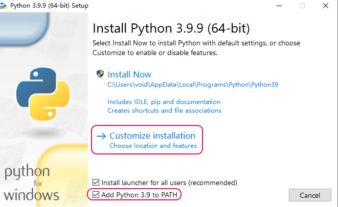

- 取消掉多余的选项

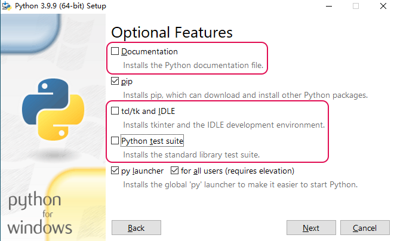

- 根据需要选择安装地址，最好是纯英文路径，不带空格等字符

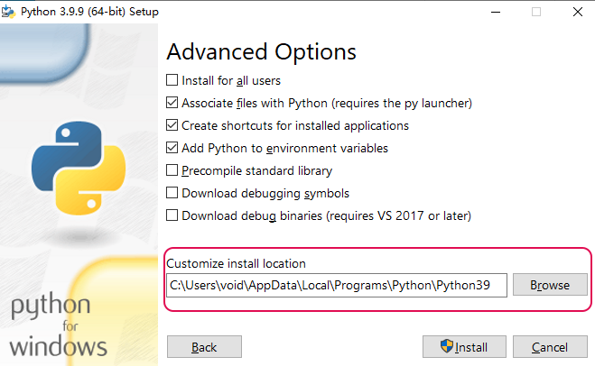


### 3.安装完成

- 根据需要决定是否禁用路径长度限制

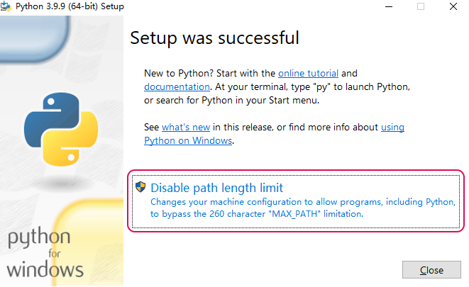

## 二、ESP-IDF安装

### 1.下载ESP-IDF Windows安装器

- [ESP-IDF 4.4 安装器](https://dl.espressif.com/dl/esp-idf/?idf=4.4)

### 2.更改pip源为国内镜像

- 因为IDF配置环境需要pip虚拟环境，国内用户使用官方源可能会timeout失败，国外用户可以不修改）推荐使用清华源 

```shell
pip config set global.index-url https://pypi.tuna.tsinghua.edu.cn/simple
```

### 3.启动安装器

- 等待系统检查，不出意外应该是没有问题的


- 选择下载

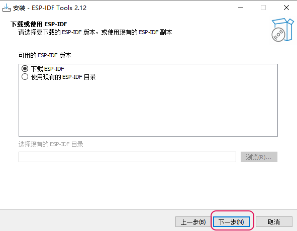

1. 由于我使用的是ESP32S3所以IDF应版本选择4.4
2. 安装路径根据个人修改建议安装到C盘以外的地方，整个IDF还是会占用不少空间的 最好不要带中文和特殊字符以及空格

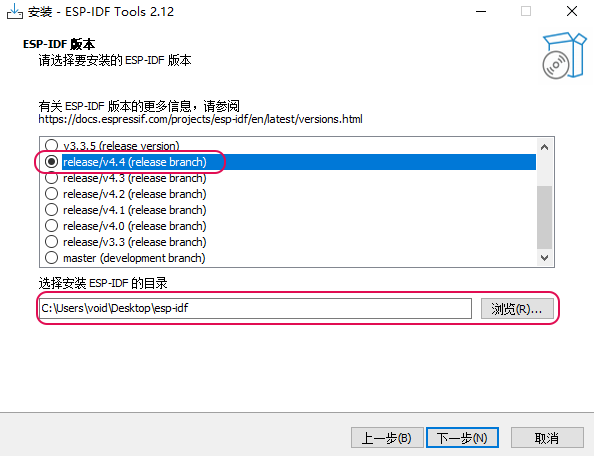

- Tools安装路径最好和esp-idf在同一目录下

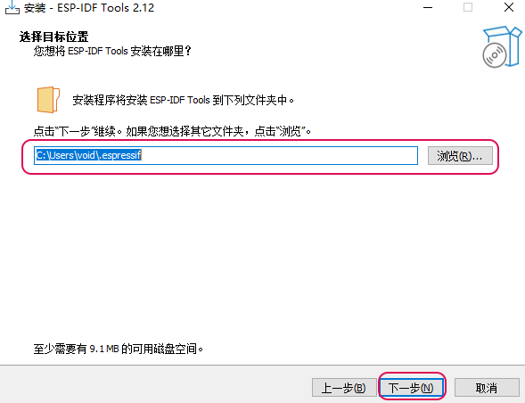

### 4.以下安装选择仅供参考

1. Eclipse推荐不安装，因为要使用其他编辑器，所以可以忽略
2. 驱动程序如果是USB转串口芯片是CP210X请全选，我的开发板是使用的CH340所以不勾选
3. 芯片根据开发需要选择
4. 推荐勾选优化，在国内Github可能会出现Clone失败的情况 ~~国外当我没说~~

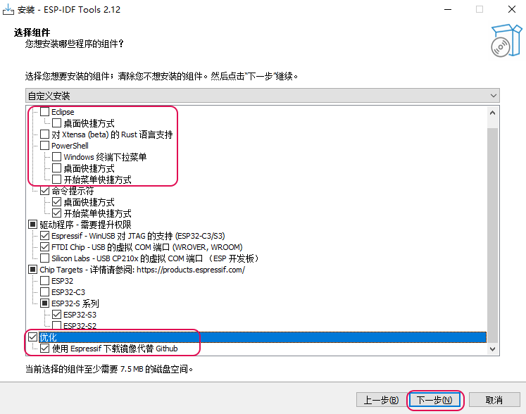

### 5.安装完成

- 建议勾选从WD中排除ESP-IDF工具

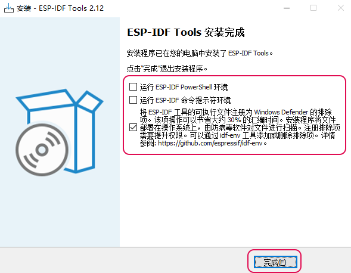

## 三、MinGW安装

### 1.从官网下载MinGW

- [MinGW下载](https://sourceforge.net/projects/mingw/)

### 2.运行安装器

- 根据个人需要选择MinGW安装目录、其余选项如不知道是什么用途请勿修改

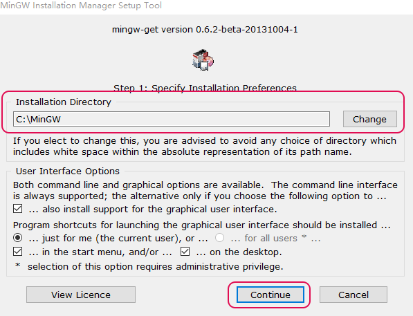

- 安装完成点击Continue 启动 MinGW安装管理器

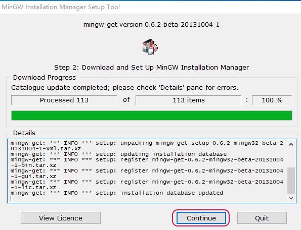

### 3.安装Mingw

- 勾选如图所示的包，然后点击Apply Changes

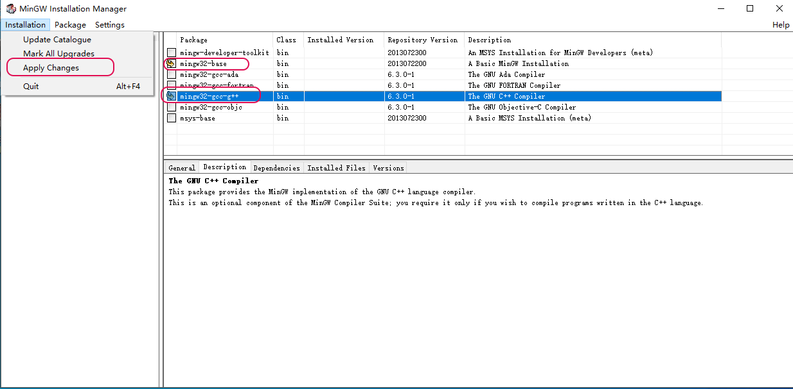

- 点击Apply开始安装

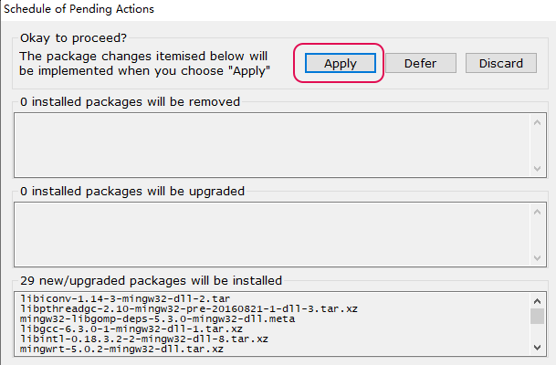

### 4.安装完成

安装完成，如果未出错，则显示会如图所示

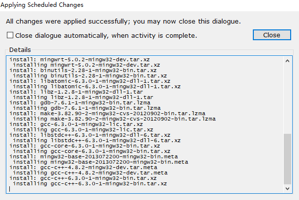

## 四、Clion环境配置

### 1.克隆工程

克隆之前请确认已经安装过git了，如果没有安装可以临时使用`.espressif\tools\idf-git\版本号\cmd\git.exe`

1.克隆 LuatOS-ESP32 (国内用户优先选择码云，两个链接源码保持一致，选择一个克隆即可)

```shell
# 从码云克隆
git clone https://gitee.com/dreamcmi/LuatOS-ESP32
# 从Github克隆
git clone https://github.com/dreamcmi/LuatOS-ESP32
```

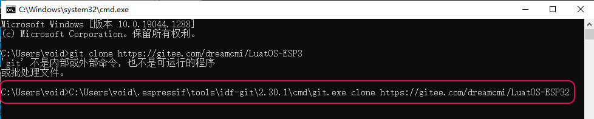

2.克隆LuatOS源码

```shell
git clone https://gitee.com/openLuat/LuatOS
```

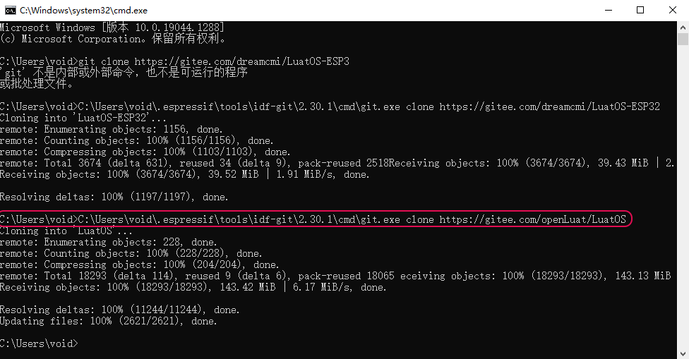

克隆LuatOS主仓库，需要与LuatOS-ESP32文件夹同级


### 2.用Clion打开工程

- 打开LuatOS-ESP32

  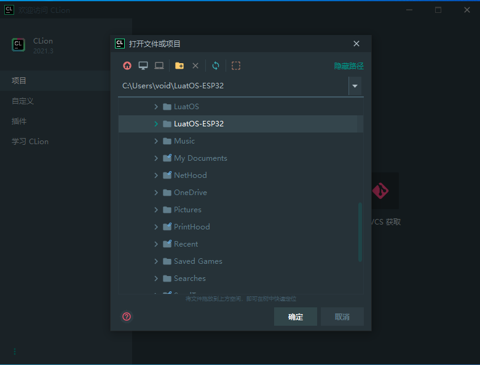

  - 选择打开为Cmake 项目

  

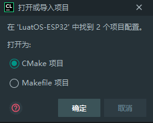

- 此处一定要选择信任项目


### 3.配置CMake工具链设置

Clion已经自动为我们配置好了Mingw，但是我们用不到

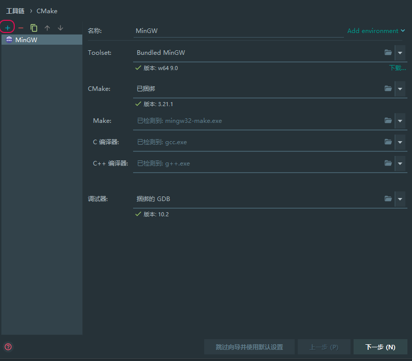

- 新建一个配置，修改Make,C编译器,C++编译器路径

```
给出的路径是基于.espressif的，请自行选择该文件夹并根据以下路径选择对应的可执行文件
Make:.espressif\tools\cmake\3.20.3\bin\cmake.exe

C编译器:.espressif\tools\xtensa-esp32s3-elf\esp-2021r2-8.4.0\xtensa-esp32s3-elf\bin\xtensa-esp32s3-elf-gcc.exe

C++编译器:.espressif\tools\xtensa-esp32s3-elf\esp-2021r2-8.4.0\xtensa-esp32s3-elf\bin\xtensa-esp32s3-elf-g++.exe
```

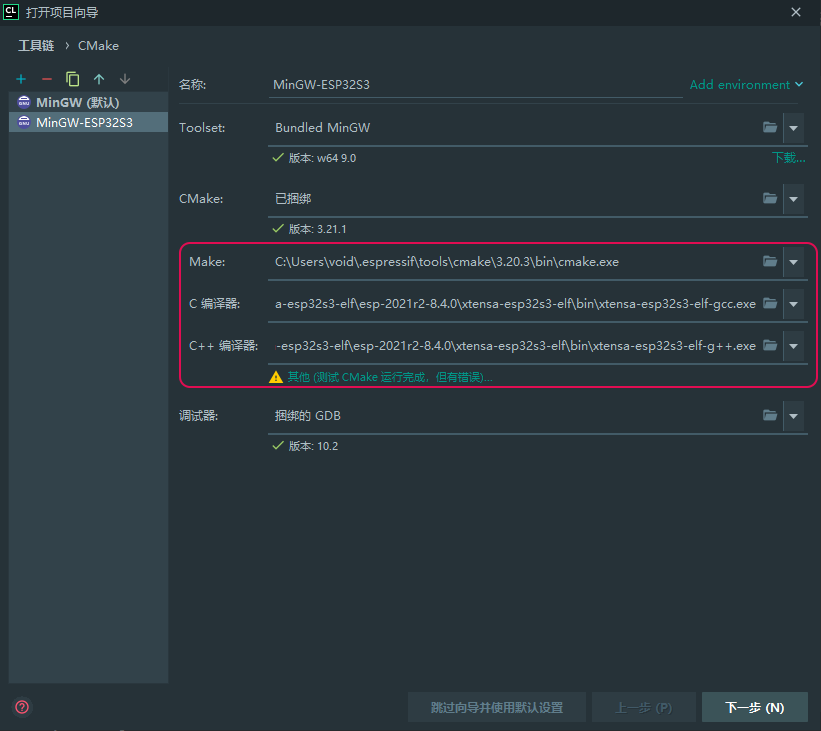

1. 工具链选择我们刚刚新创建的配置
2. Generator 修改为 Ninja （如果自动识别为Use Default Ninja这可以不修改）

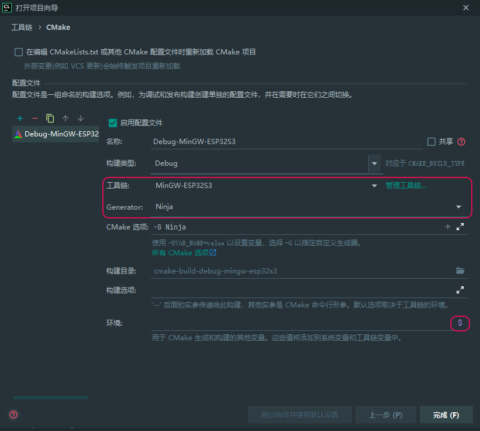

- 点击环境后面的$

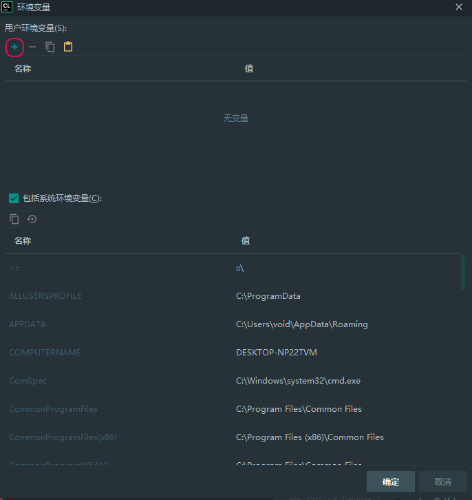

- 点击+号 新建环境变量

```
下面的环境变量左边为名称 空格后为值 请勿把空格复制进去
设置工程Target 为ESP32S3
IDF_TARGET esp32s3
设置工程下载和监视的串口波特率(因为下载和监视波特率公用该变量，所以会导致下载特别慢)
ESPBAUD 115200
设置工程下载和监视的串口号
ESPPORT COM34
设置ESP-IDF的安装路径
IDF_PATH 你的ESP-IDF安装路径 如：C:\Users\void\Desktop\esp-idf-3
设置PATH环境变量
PATH (操作见下面)
```

- 设置ESP-IDF工具链路径，运行ESP-IDF 4.4 CMD

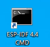

1. 再打开的窗口中输入 `echo %PATH%`
2. 会输出如图所示很多路径

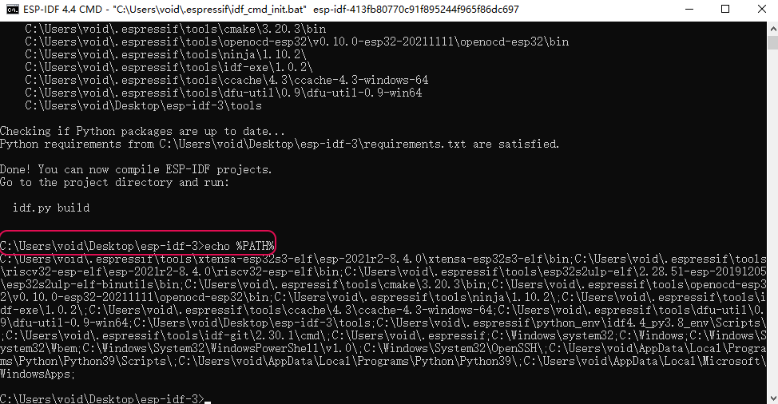

- 选择所有ESP相关的路径，右键复制下来

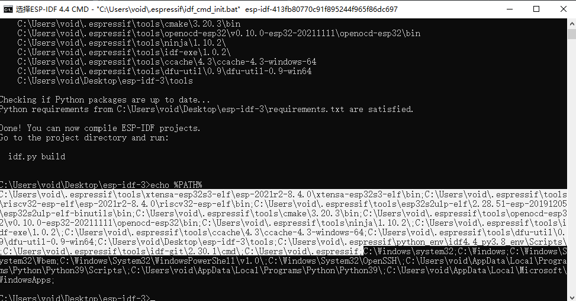

- 回到环境变量窗口

```
PATH 你刚刚复制的路径
```

- 点击完成后，等待CMake加载完成
- 如果加载成功，会在Cmake窗口中输出[已完成] 并且项目下方会出现两个文件夹

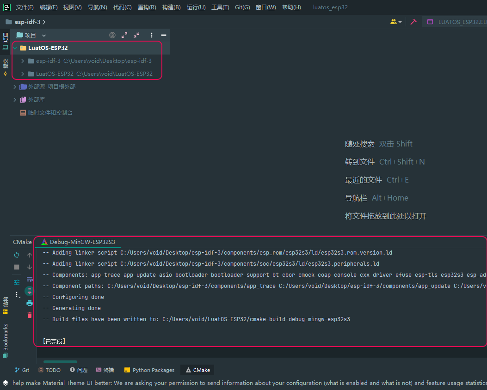

### 4.下载固件与脚本

#### 1.下载固件

- 选择flash下载固件，点击左侧构建图标

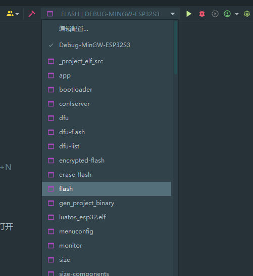

- 就会看到已经开始编译固件了，在编译完成之后，会自动进行下载

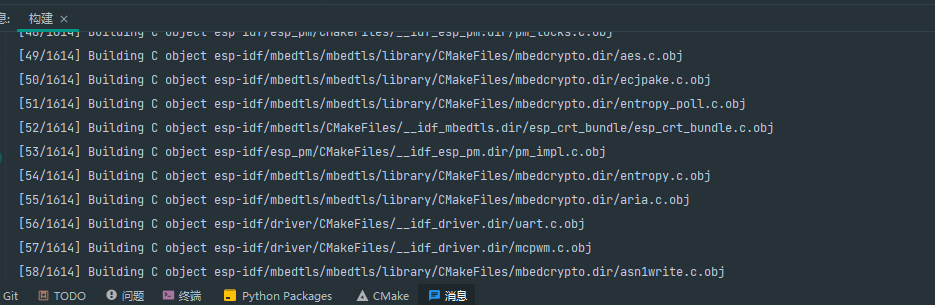

#### 2.串口监视

选择monitor，点击左侧构建即可

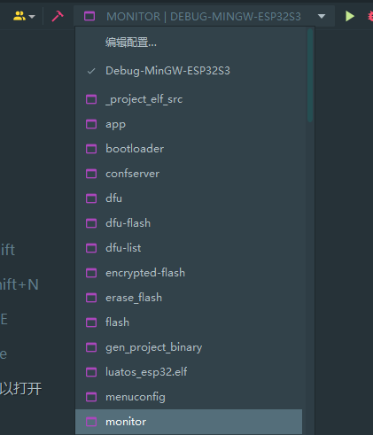

#### 3.下载脚本

1. 点击编辑配置…
2. 点击+添加新配置，选择Shell Script

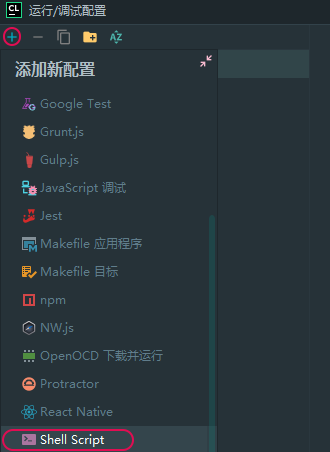

```
脚本路径选择LuatOS-ESP32\tools\esp32v3.py
脚本选项 参考 tools内的说明 这里的-f是设置只下载脚本文件
工作目录 需要选择tools文件夹
解释器选项，请选择你安装的Python的可执行文件
```

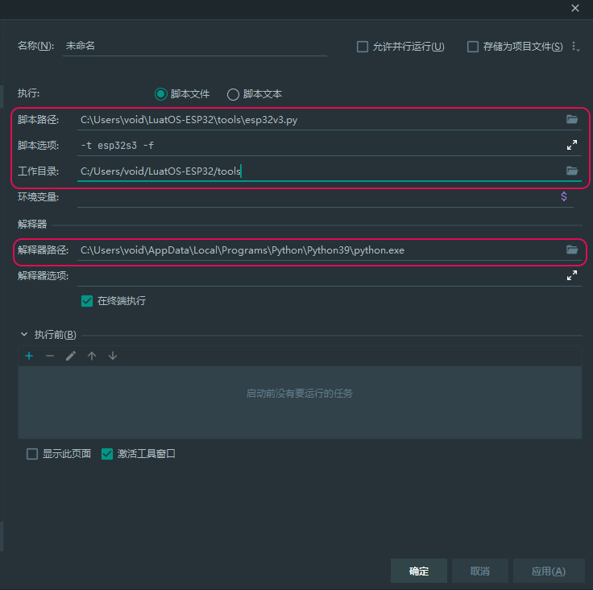

1. 在下载脚本之前请先查看tools内的文档说明 
2. 需要在config.toml内修改对应的参数，否则下载将失败
3. 脚本选项按文档说明自行填写
4. 拉到最下面选择我们刚刚新建的配置，点击运行即可下载脚本


