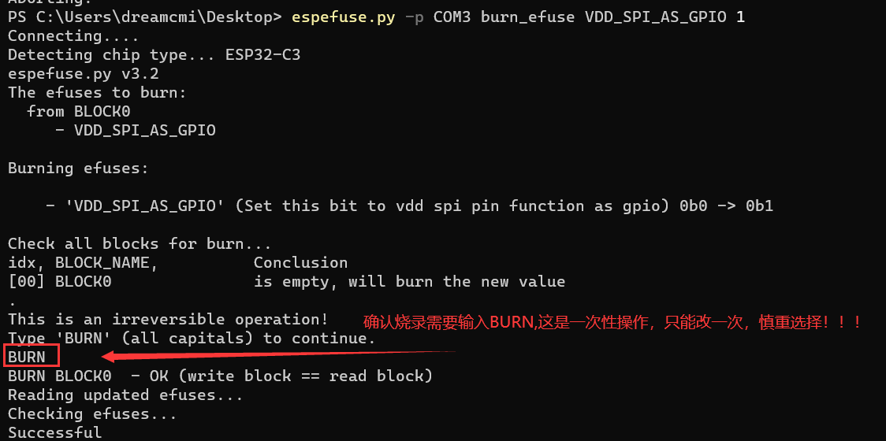

# ESP32C3解锁使用IO11

本篇介绍如何给ESP32C3多释放一个io。

ESP32C3的GPIO11(VDD_SPI)默认功能是给flash供电，我们完全可以使用外部3.3v给flash供电，将此IO用作通用io，以下是操作流程，注意以下的操作只能执行一次，更改后不能复原。

1、使用pip安装esptool。`pip install esptool`

2、将开发板插入电脑

3、打开命令行窗口输入`espefuse.py -p 你的端口 burn_efuse VDD_SPI_AS_GPIO 1`

