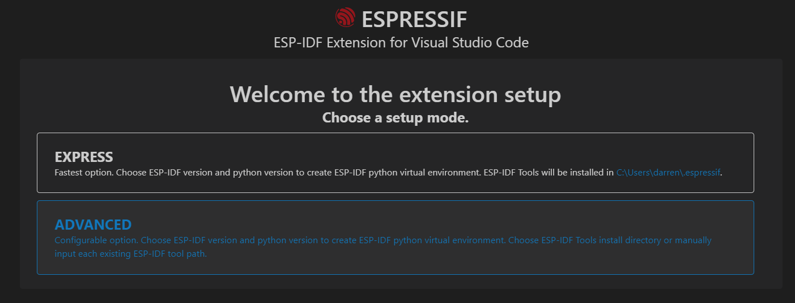
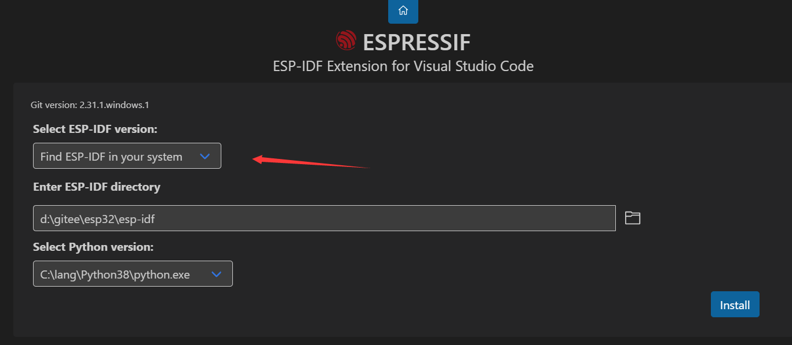
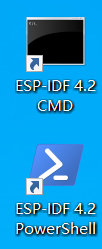

# 如何使用源码

## 一、通过乐鑫官方安装器配置idf环境

链接：https://docs.espressif.com/projects/esp-idf/zh_CN/v4.2/esp32/get-started/windows-setup.html

下载windows版exe进行一键安装

注：1、首先确认你的电脑上安装了python3，git，如果没有请先安装

​		2、更改pip源为国内镜像（因为配置环境需要pip虚拟环境，国内用户使用官方源可能会timeout失败，国外用户可以不修改）推荐使用清华源 `pip config set global.index-url https://pypi.tuna.tsinghua.edu.cn/simple  `

## 二、通过VSCode配置ide环境

#### 1、安装VSCode

#### 2、安装c语言插件和espidf插件（都可以直接搜索）

#### 3、配置VSCode

在VSCode里按F1输入`ESP-IDF: Configure ESP-IDF extension`进行配置

##### （1）选择`express`

##### （2）选择本地的espidf文件夹

（3）点击install进行自动配置

## 三、导入工程

#### 1、克隆仓库

`git clone https://gitee.com/dreamcmi/LuatOS-ESP32`

`git clone https://github.com/dreamcmi/LuatOS-ESP32`

国内用户有限选择码云，两个链接源码保持一直，克隆一个即可

#### 2、进入本地文件夹，右键使用vscode打开

#### 3、更改`c_cpp_properties.json`

将`"compilerPath"`后面路径的用户名改成你的即可

#### 4、更改`settings.json`

将`"idf.customExtraPaths"` `"idf.pythonBinPathWin"` `"idf.toolsPathWin"` 后面路径的用户名改成你的即可

将`"idf.espIdfPathWin"`后面的路径改成你espidf源码所在的地址即可

## 四、注意事项

1、推荐使用乐鑫官方工具创建的快捷方式进行编译和下载（VSCode经常莫名bug）

2、sdkconfig文件非必要不要修改，已经给出default文件作为默认

3、欢迎提pull request 和issue